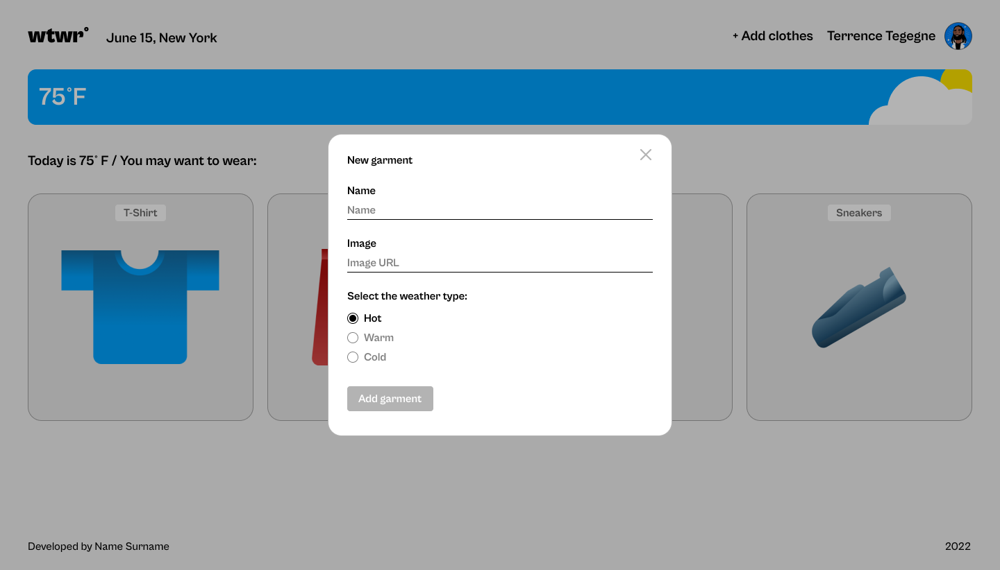
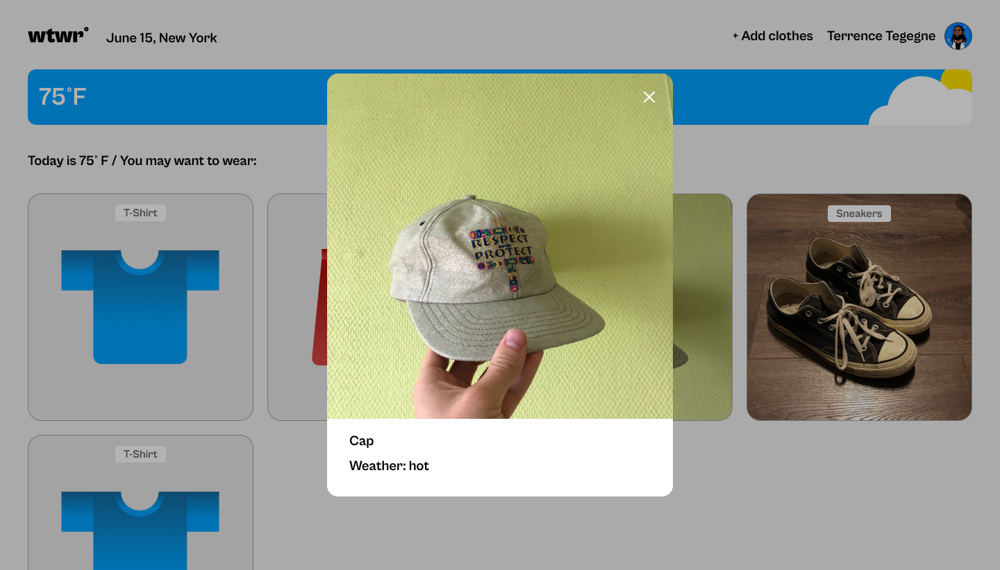
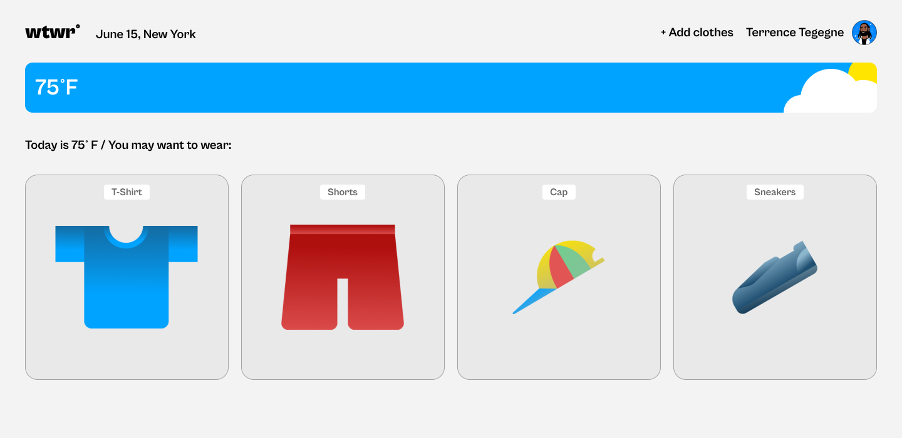

# WTWR (What to Wear)

## Live Demo

## Live Demo

Check out the project here: [What to Wear - Weather Station](https://aliminagar.github.io/se_project_react/)

## Overview

**WTWR (What to Wear)** is a dynamic web application designed to provide clothing suggestions based on real-time weather data. Using the **OpenWeather API**, the application retrieves the current temperature of a user's location and recommends suitable clothing items. Additionally, users can manage their wardrobe by adding garments and categorizing them based on weather conditions.

## Features

- **Real-time Weather Data**: Fetches live weather information based on user location.
- **Clothing Recommendations**: Provides tailored suggestions for appropriate clothing based on the current temperature.
- **User Interaction**: Users can add new clothing items with an intuitive form interface.
- **State Management**: Utilizes **React Hooks** for efficient state handling and component updates.
- **Responsive UI**: Optimized for different screen sizes.
- **Modern Frontend Stack**: Built using **React, Vite, and CSS** for a fast and smooth user experience.

## Technologies Used

- **React (with Hooks)**
- **Vite (for fast development and builds)**
- **CSS (for styling and layout)**
- **OpenWeather API** (for fetching weather data)

## Screenshots

### **1. Add Clothes Popup**

This is an example of the pop-up interface where users can add a new clothing item by specifying the name, image URL, and selecting the appropriate weather category.

### **2. Garment Preview**

Once a user adds a garment, they can view it in a larger modal to see details such as the name and weather category.

### **3. Main Page**

The main page dynamically displays the weather information and suggests suitable clothing based on the current conditions.

## How It Works

### **Weather Data Retrieval**

- The application fetches real-time weather data from the **OpenWeather API** using the user's coordinates.
- The retrieved data includes **temperature, weather conditions, and location details**.

### **Clothing Recommendation Algorithm**

- Based on the **temperature and weather conditions**, the app filters the available clothing items.
- Users see a selection of garments best suited for the current weather.

### **User Interaction**

- Users can click on the **"+Add Clothes"** button to open a modal.
- They can enter a **clothing item name, provide an image URL, and select a weather category**.
- Once submitted, the **new item appears on the main page** under the appropriate category.

## Installation & Setup

To run this project locally, follow these steps:

Clone the repository:

git clone https://github.com/aliminagar/se_project_react.git

Navigate to the project directory:

cd se_project_react

Install dependencies:

npm install

Start the development server:

npm run dev

Open the application in your browser at:

http://localhost:3000

Deployment

This project can be deployed on GitHub Pages:

Build the project:

npm run build

Deploy using GitHub Pages:

npm run deploy

Access the project at:

https://aliminagar.github.io/se_project_react/

Author

Developed by Alireza Minagar - 2025

GitHub Repository

## Visit Repository

[Click here to visit the project repository](https://github.com/aliminagar/se_project_react.git)
